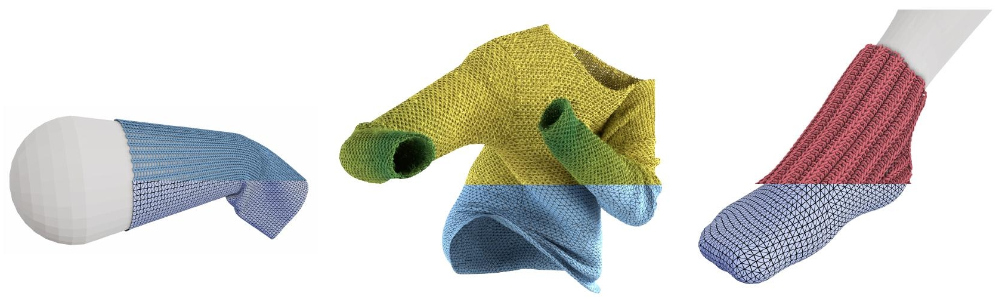

# Mechanics-Aware Deformation of Yarn Pattern Geometry


This repository contains the published code for the paper 'Mechanics Aware Deformation of Yarn Pattern Geometry' by Georg Sperl, Rahul Narain, Chris Wojtan.

Project Website: [TODO](https://visualcomputing.ist.ac.at/publications/)


## Download / Setup

This repository uses submodules that need to be cloned recursively:
```sh
git clone --recurse-submodules <REPOSITORY>
```
If cloned non-recursively, you can download the submodules afterwards using
```sh
`git submodule update --init --recursive`
```

Next, use the submodule [vcpkg](https://github.com/microsoft/vcpkg/) to install additional dependencies from within the `vcpkg/` directory:
```sh
./bootstrap-vcpkg.sh
./vcpkg install eigen3 tbb magnum[gl,meshtools,shaders,scenegraph,trade,debugtools,sdl2application] magnum-integration[imgui] magnum-plugins[pngimporter,jpegimporter]
```

## Compile & Run

We tested our code on Ubuntu 18.04 with g++ version > 8 for the filesystem API.
To compile and run our interactive program, we use a helper python script: `python exec.py`.

To only compile a debug build without cpu-paralleism, use e.g.: `python exec.py -d -p 0 -r 0`.

With the file `obj2bin.cpp` we provide a separate script/target that converts a folder of '.obj'-sequences into a single binary file for fast preloading. Usage: `python exec.py obj2binary IN-FOLDER OUT-FILE`

## Files/Folders

### Source Code

The code itself is located in the `src/` directory. You'll find `src/yarns/YarnMapper.h` (specifically the `step()` method) to contain the main algorithm detailed in the paper.

Loop/rendering/gui related code can be found in `MainApplication.h` and the `render/` directory.

### Data

The `data/` directory contains the following subdirectories:

- `objseqs/` contains cloth mesh animations as folders of '.obj'-sequences. (See also: `ObjSeqAnimation.h`)

- `binseqs/` contains binary single-file versions of such mesh animations for fast loading. (See also: `BinSeqAnimation.h, obj2bin.cpp`)

- `pbdscene/` contains the meshes used in our real-time sock example. (See also: `PBDSimulation.h`)

- `yarnmodels/` contains the precomputed local-displacement data for the several yarn patterns we experimented with. (See also: `Model.h`)

- `textures/` contains an assortment of matcaps (for shading yarns, or cloth/obstacle meshes), cloth textures, and the base texture for twistable ply/fiber-detail.

The meshes/animation have been mostly created with our previous method [TODO HYLC REPO](.) (sweater animations, stretching/draping), or Blender.

The dummy.fbx file in the `data` directory is used for a rudimentary fbx-export of yarn or cloth geometry.

### Data Generation

The `generate_yarnmodels` folder contains the scripts we used to precompute the local-displacement data. These scripts use the python-bound optimization from our previous paper [TODO HYLC REPO](.).

Note that we already provide generated data in the `data/yarnmodels/` directory, so it is not necessary to download/compile the HYLC code or rerun those scripts.

<!-- ## Other Explanation
TODO maybe about model structure, pix and strain ... axes.txt
  show where created and where loaded -->

## License & Citation

This code is released under the MIT license (see [LICENSE.txt](LICENSE.txt)).
Note that some files in `src/` (files from the Magnum library, but also `threadutils.h` and other dependencies) may have a (compatible) license comment at the top instead.

If you use our code, please consider citing our work:
```
@article{sperl2021madypg,
  author    = {Sperl, Georg and Narain, Rahul and Wojtan, Chris},
  title     = {Mechanics-Aware Deformation of Yarn Pattern Geometry},
  ...
  year      = {2021},
  ...
}
```
<!-- @article{sperl2020hylc,
  author    = {Sperl, Georg and Narain, Rahul and Wojtan, Chris},
  title     = {Homogenized Yarn-Level Cloth},
  journal   = {ACM Transactions on Graphics (TOG)},
  number    = {4},
  volume    = {39},
  year      = {2020},
  publisher = {ACM}
} -->